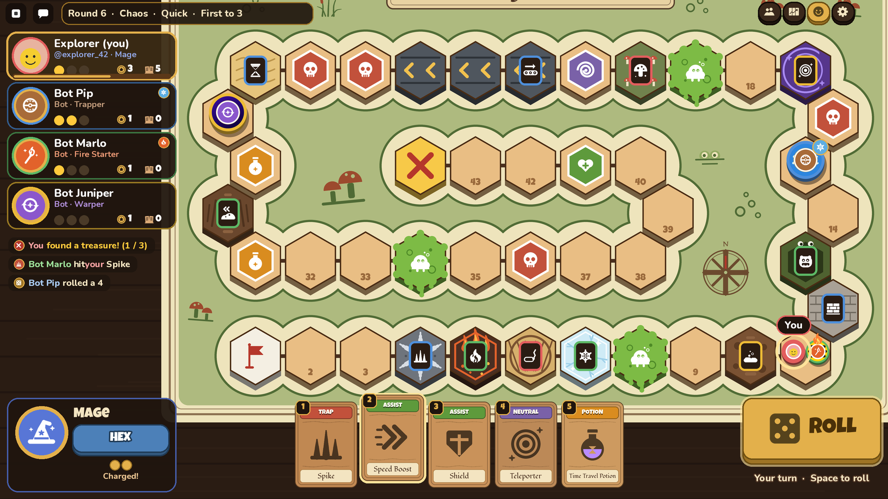
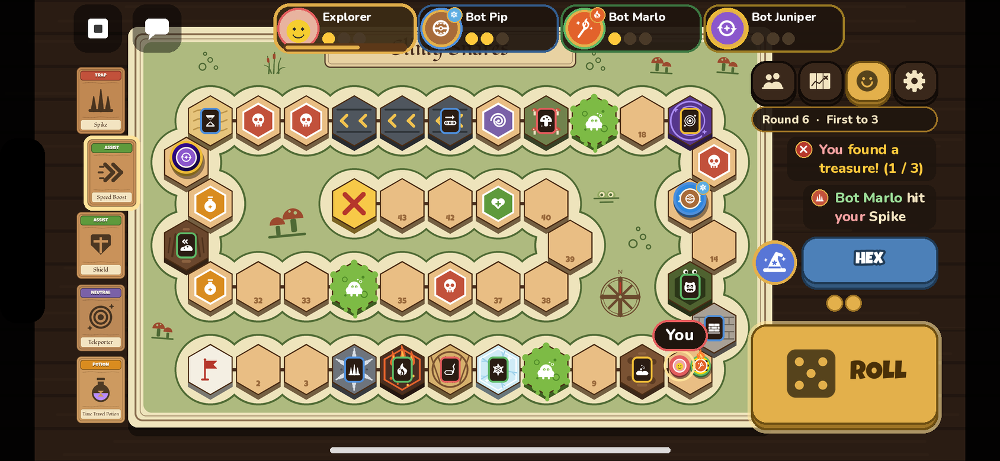
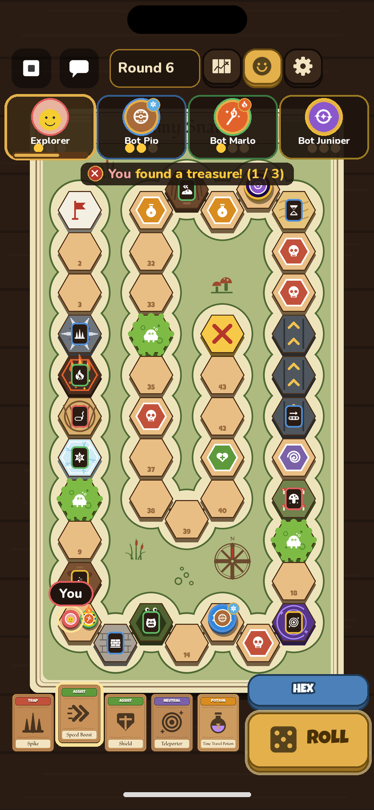
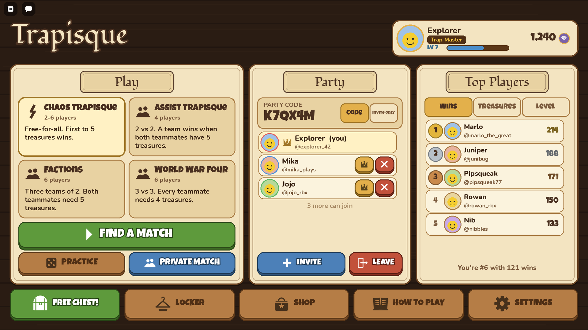
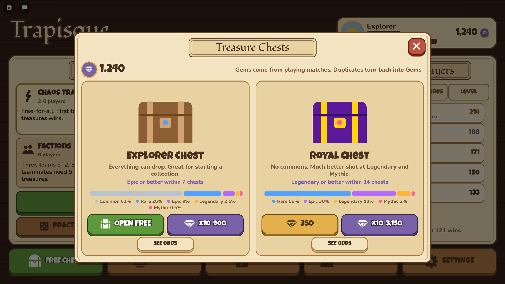

# Trapisque

Trapisque is a race to the treasure across a trap-filled treasure map, for 2 to 6
players. It started as a board game, and this repository is its Roblox version: a
purely top-down 2D game that uses the Roblox engine but doesn't look like a Roblox
game. There is no 3D world. Apart from players' own Roblox avatar headshots, everything
you see is drawn from plain UI frames, with no uploaded images.



| Phone held sideways | Phone held upright |
| --- | --- |
|  |  |

| Lobby | Treasure chests |
| --- | --- |
|  |  |

More previews are in [`docs/previews`](docs/previews): the icon set, the three maps,
the wooden cards, the collectibles, the lobby on phones and every tile skin.

## What's in the game

- **The full board game.** Six characters, trap, assist and neutral cards, the Potion
  Seller, natural traps, three maps (Blissful Tricks, Junction Dungeon, Slimy Snares)
  and four modes (Chaos, Assist, Factions, World War Four). See
  [docs/RULES.md](docs/RULES.md) for the rules as played, including every change made
  for the online version.
- **Match lengths.** Quick (2 treasures), Standard (3) and Classic (5, the rulebook).
- **Quick Play matchmaking.** Queue for any mode on your own or as a party. Queues are
  shared by every server, and bots fill empty seats if you wait long enough.
- **Parties.** Create a party and invite friends with Roblox invites, or share its
  6-letter code. A party can be open to its code or invite-only. Joining a party on
  another server takes you to that server.
- **Practice and private matches.** Pick the mode, map, length and number of bots.
- **Bots.** They play every character and card, and step in for anyone who goes away
  or leaves.
- **Treasure Chests.** A cosmetic-only collection: pawn skins, dice, trails, emotes and
  titles. You open chests with Gems, which you earn by playing.
- **Gamepasses** that never touch gameplay (see below).
- **Top Players.** All-time leaderboards for wins, treasures found and level, with
  avatars and @usernames.
- **Any screen.** The layout follows the device: the board fills the screen on a PC,
  phones held sideways keep the cards under your left thumb and ROLL under your right,
  and phones held upright stand the board up. Nothing sits over Roblox's own buttons,
  notches or the home bar.
- **Sound.** Dice on felt, wooden steps, card swishes and a tavern / board-game score,
  all from Roblox's free audio library (Music and Sound effects can each be turned off).

## Project layout

```
src/shared/          ReplicatedStorage.Shared: code used by both server and client
  Config.lua         every tunable number (rules, timers, rewards, gamepass ids)
  Game/              the rules engine: Engine, Items, Characters, Maps, Modes, Bot...
  Meta/              cosmetics, chests, gamepasses, matchmaking logic
src/server/          ServerScriptService.Server: data, parties, matchmaking, matches
src/client/          StarterPlayerScripts.Client: all screens and the art library
  UI/                Icons, Cards, Shapes, Widgets... plus Lobby/ and Match/ screens
src/first/           ReplicatedFirst loading screen
tests/               rules, simulation, meta and board-layout tests (plain Luau)
tools/               test bundler, type-check script and the preview renderer
docs/                rules and preview images
trapisquebooklet.html  the original rulebook
```

The rules engine (`src/shared/Game`) is pure Luau with no Roblox APIs. The server runs
it authoritatively and streams events to clients, which animate them. The tests run
the same engine outside Roblox.

## Building and running

You need [Rojo](https://rojo.space) 7.x.

```sh
rojo build default.project.json -o Trapisque.rbxlx   # a place file to open in Studio
# or, to live-sync while editing:
rojo serve                                            # then connect with the Rojo plugin
```

In Studio:

1. Open **Game Settings → Security** and turn on **Enable Studio Access to API
   Services**, so profiles can load and save. The game still runs without it, but
   progress isn't kept.
2. Press **Play**. Studio can't teleport, so matchmaking, parties and matches all run
   on the one test server. Every gamepass counts as owned in Studio
   (`Config.StudioOwnsAllPasses`), so you can try everything.
3. To test with several players, use **Test → Clients and Servers**.

## Publishing

1. Publish the place to Roblox. It's a single place: public servers are lobbies, and
   each Quick Play match runs on a reserved server of the same place.
2. The game uses DataStores (profiles), MemoryStores (matchmaking queues and party
   codes), TeleportService (reserved match servers, cross-server party joins),
   SocialService (invites), MarketplaceService (gamepasses) and PolicyService. They
   all work in a published experience without extra setup.
3. Create the gamepasses (next section) and paste their ids into
   `src/shared/Config.lua`.

## Gamepasses

Create these on the Creator Dashboard (**Monetization → Passes**) and put their ids in
`Config.GamePasses`. A pass left at `0` is hidden from the in-game Shop.

| Key | Name | What it gives |
| --- | --- | --- |
| `VIP` | VIP | +25% Gems from every match, a free Explorer Chest every day, the Royal Crown pawn and VIP title, and a gold name in parties and matches. |
| `DoubleGems` | 2x Gems | Double Gems from every match (stacks with VIP). |
| `LuckyCharm` | Lucky Charm | Legendary and Mythic chest odds ×1.5, and the chest screens show your boosted odds. Hidden for players whose region doesn't allow paid random items. |
| `EmotePack` | Emote Pack | 6 extra emotes, and up to 6 emotes equipped in matches. |

None of them changes how a match plays. They only speed up or add to the cosmetic
collection.

## Treasure Chests

- **Explorer Chest:** 100 Gems (10 for 900). Odds are Common 62%, Rare 26%, Epic 9%,
  Legendary 2.5% and Mythic 0.5%. You're guaranteed an Epic or better at least every
  10 chests and a Legendary or better every 50.
- **Royal Chest:** 350 Gems (10 for 3,150). Odds are Rare 58%, Epic 30%, Legendary 10%
  and Mythic 2%. You're guaranteed a Legendary or better at least every 20 chests.
- Items you don't own yet are 3× as likely within a rarity, and duplicates turn back
  into Gems.
- Gems can't be bought with Robux. They come from matches (finishing, treasures,
  winning, levelling up), a daily reward and the starting gift.

The odds, prices and rewards are in `src/shared/Meta/Gacha.lua` and `Config.Rewards`.

## Development

### Tests

The tests run the rules, bot simulations, chest maths and board layouts with the
standalone [Luau](https://github.com/luau-lang/luau/releases) CLI:

```sh
python3 tools/bundle.py build/tests.luau tests/harness.luau tests/engine_spec.luau \
  tests/sim_spec.luau tests/meta_spec.luau tests/layout_spec.luau tests/zz_run.luau
luau build/tests.luau
```

`tools/bundle.py` fakes just enough of Roblox's `script` tree for the shared modules to
`require` each other outside Studio.

### Type checking

```sh
DEFS=/path/to/globalTypes.d.luau tools/typecheck.sh
```

This needs `rojo` and [luau-lsp](https://github.com/JohnnyMorganz/luau-lsp) on your
`PATH`, plus Roblox's type definitions (`globalTypes.d.luau` from the luau-lsp repo;
without `DEFS` the script looks in `.luau/globalTypes.d.luau`). It checks every file
in strict mode and reports only real mistakes, like unknown properties or wrong
argument counts.

### Previews

`tools/preview/` re-draws the game's art from the same data the Lua uses (icons,
boards, cards, collectibles and full screens) as PNGs, so the look can be reviewed
without opening Studio. It needs Python 3 with Pillow, and the Luckiest Guy,
Fondamento and Nunito fonts from Google Fonts in `tools/preview/fonts` (or in a folder
named by `TRAPISQUE_FONTS`). Each script's header explains its inputs. The data comes
from `tests/dump_*.luau`, run through the bundler (bundle `tests/preview_skins.luau`
first for the board and screen dumps: it records the tile skins from the game's own
`TileSkins` code). `tools/preview/hud.py` draws the match screen and lobby at real
device sizes from the game's `Layout` module.

### Art rules

Everything is built from Frames with `UICorner` and `UIStroke`. Icons, card art, board
decorations and pawn patterns are data (`IconData`, `DecorData`, `PawnPatterns`)
drawn by `Icons` and `Shapes`. The style is deliberately flat:

- no gloss, shine, glows or blurred shadows, only hard offset shadows
- gradients only on the few cosmetics that are meant to have them
- nothing overlapping or sticking out of its shape
- text sized so it fits rather than shrinking at random

The fonts (Fondamento, Luckiest Guy, Nunito) are built into Roblox, and the sounds and
music are free Roblox audio library assets (listed in `src/client/Sound.lua`), so the
game needs no uploads.
